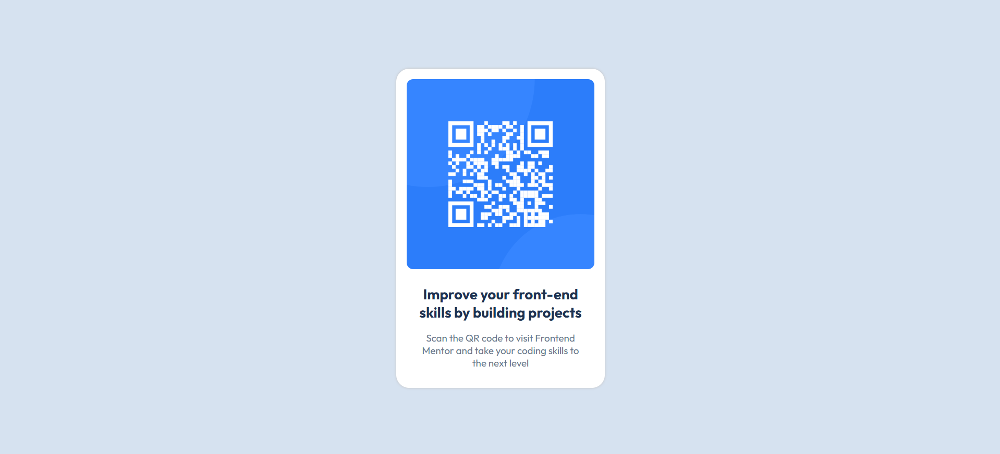

# Frontend Mentor - QR Code Component Solution

This is my solution to the [QR code component challenge](https://www.frontendmentor.io/challenges/qr-code-component-iux_sIO_H) on Frontend Mentor.

## 🔗 Live Preview

👉 [Click here to view the live site](https://mohamed-ahmed-137.github.io/qr-code-component-main/)

---

## 🧠 What I learned

- How to use Flexbox to center content vertically and horizontally.
- How to structure simple layout using semantic HTML.
- How to style a card component with padding, border-radius, and box-shadow.
- How to make a design responsive using media queries.

---

## 💻 Built With

- Semantic HTML5 markup
- CSS custom properties
- Flexbox
- Mobile-first workflow
- Google Fonts – [Outfit](https://fonts.google.com/specimen/Outfit)

---

## 📸 Screenshot

---

## 🛠️ Author

- GitHub: [@Mohamed-Ahmed-137](https://github.com/Mohamed-Ahmed-137)
- Frontend Mentor: [@Mohamed-Ahmed-137](https://www.frontendmentor.io/profile/Mohamed-Ahmed-137)

---

## 📬 Feedback

Feel free to leave feedback, open issues, or suggest improvements!
